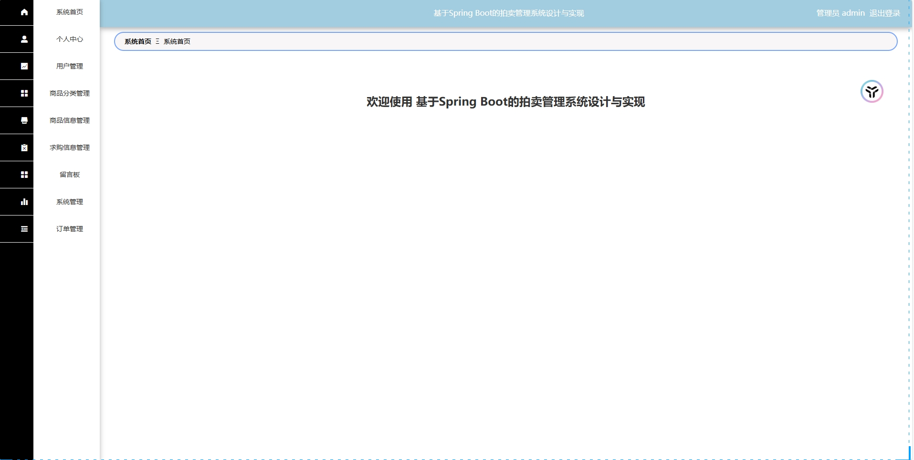

# springbootA305
springbootA305拍卖管理系统
 
## 查看主页获取源码

### 一、关键词

拍卖管理系统，拍卖系统
### 二、作品包含
源码+数据库+万字设计文档+PPT+全套环境和工具资源+本地部署教程

### 三、项目技术
前端技术：Vue2.0、Element-ui
后端技术：Java、SpringBoot2.0、MyBatis

### 四、运行环境（以下版本亲测，其他版本兼容性请自行测试）
开发工具：IDEA/eclipse  + VSCODE

数据库：MySQL5.7

数据库管理工具：Navicat10以上版本

环境配置软件： JDK1.8 + Maven3.6.3

前端Nodejs：14

浏览器：谷歌浏览器

### 五、项目介绍
项目编号：springbootA305

拍卖系统是一个通过设定规则、组织流程，让买方以竞价方式争夺物品所有权或服务权，并最终确定最高出价者为成交方的线上或线下交易平台及配套机制的总和。

系统主要分为二大模块：即管理员模块和用户模块。本文从拍卖管理系统流程分析入手，分析了其功能性需求，设计了一个由管理员和用户二部分组成的拍卖管理系统。用户可在系统上查看商品信息、公告信息、留言板等；管理员可通过后台管理界面管理用户信息等功能

### 六、运行截图

